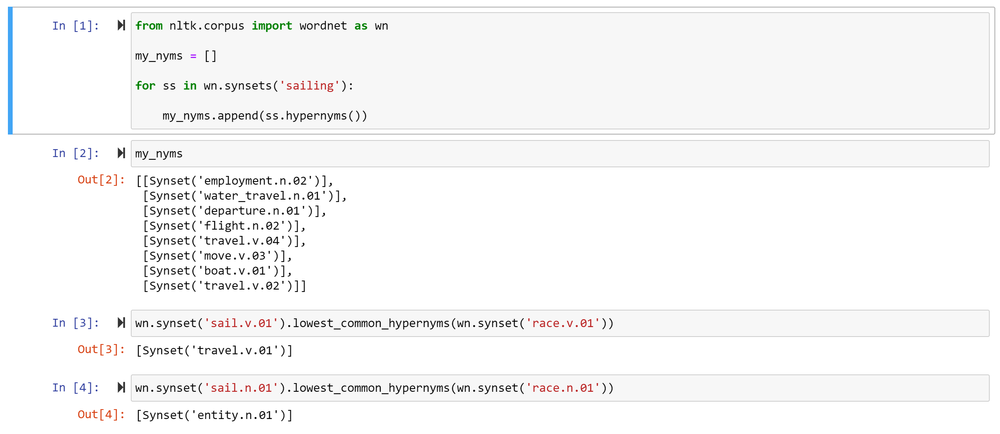

What is/are the next logical step/s?
=======================

* Feature extraction via text similarity analysis
* Explore WordNet's hypernym generation capabilities (see example below for implied strengths and limitations):

* Take inspiration from example on previous page to extract TF-IDF vector, and perhaps
  * Cluster hashtags using K-Means (scikit-learn)

* Additionally, logistic regression could be used to produce estimated probabilities of hashtag affinity in order to recommend/inspire
